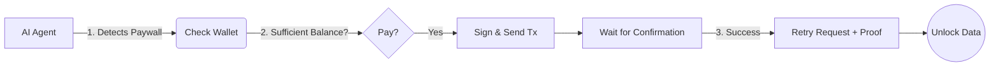

# @alleyboss/micropay-solana-x402-paywall

> Production-ready Solana micropayments library wrapper for the official x402 SDK.

[](https://www.npmjs.com/package/@alleyboss/micropay-solana-x402-paywall)
[](https://opensource.org/licenses/MIT)
[](https://bundlephobia.com/package/@alleyboss/micropay-solana-x402-paywall)
[](https://solana-x402-paywall.vercel.app)

## 🚀 What It Does

Turn any content into paid content with **one-time micropayments** on Solana. fully compatible with the official [x402.org](https://x402.org) protocol.

This library enhances the official SDK with features like **AI Agent Payments**, **Hybrid Sessions**, and **Express.js Middleware**.

```bash
npm install @alleyboss/micropay-solana-x402-paywall @x402/core @x402/svm @solana/web3.js
```

## ✨ Features

| Feature | Description | Status |
|---------|-------------|--------|
| 🔥 **x402Fetch** | Drop-in `fetch()` replacement with auto-payment | ✅ **NEW in v3.4** |
| 💰 **SOL & USDC** | Native SOL and SPL tokens (USDC, USDT) | ✅ Verified by `@x402/svm` |
| 🔐 **x402 Protocol** | Full HTTP 402 compliance | ✅ Powered by `@x402/core` |
| 🌐 **PayAI Format** | Multi-chain payment format support | ✅ Built-in |
| 🔑 **JWT Sessions** | "Pay once, unlock for 24h" logic | ✅ Built-in (Hybrid Support) |
| 🛡️ **Replay Protection** | Prevent double-spend / replay attacks | ✅ Managed by x402 Facilitator |
| 🔌 **Express Integration** | Middleware for Express/Node.js | ✅ Built-in |
| 💵 **Price Conversion** | USD↔SOL with multi-provider fallback | ✅ Built-in |
| 🤖 **AI Agents** | Autonomous payment execution for agents | ✅ Built-in |
| ⚡ **Priority Fees** | Compute unit price optimization | ✅ Supported (Agent Module) |
| 📦 **Versioned Tx** | v0 Transaction support | ✅ Native (x402 SDK) |
| 🌳 **Tree-Shakeable** | Modular exports | ✅ Built-in |

## 🔥 x402Fetch — The Killer Feature (NEW in v3.4)

Replace `fetch()` with `x402Fetch()` and **402 responses are handled automatically**.

```typescript
import { createX402Fetch } from '@alleyboss/micropay-solana-x402-paywall/fetch';
import { useWallet } from '@solana/wallet-adapter-react';

// Create configured fetch instance
const x402Fetch = createX402Fetch({
  wallet: useWallet(),           // Browser wallet adapter
  network: 'mainnet-beta',
  onPaymentRequired: async (req) => {
    return confirm(`Pay ${req.amount} lamports to ${req.payTo}?`);
  },
});

// Use it like fetch — that's it!
const response = await x402Fetch('https://api.example.com/premium-data');
const data = await response.json();
```

### Server-Side / AI Agent Usage

```typescript
import { createX402Fetch } from '@alleyboss/micropay-solana-x402-paywall/fetch';
import { Keypair } from '@solana/web3.js';
import bs58 from 'bs58';

const agentKeypair = Keypair.fromSecretKey(
  bs58.decode(process.env.AGENT_PRIVATE_KEY!)
);

const x402Fetch = createX402Fetch({
  wallet: agentKeypair,  // Server-side keypair
  network: 'mainnet-beta',
});

// Autonomous payment — no user interaction needed
const response = await x402Fetch('https://api.example.com/ai-data');
```

### Error Handling

```typescript
import { X402PaymentError, isUserRejection } from '@alleyboss/micropay-solana-x402-paywall/fetch';

try {
  await x402Fetch('/api/premium');
} catch (error) {
  if (isUserRejection(error)) {
    console.log('User declined payment');
  } else if (error instanceof X402PaymentError) {
    console.log('Payment failed:', error.code);
    // Codes: USER_REJECTED, INSUFFICIENT_BALANCE, TRANSACTION_FAILED, etc.
  }
}

## 📦 Quick Example (Express.js)

```typescript
import express from 'express';
import { x402ResourceServer } from '@x402/core/server';
import { x402Middleware } from '@alleyboss/micropay-solana-x402-paywall/express';

const app = express();
// The x402ResourceServer handles protocol logic and facilitator communication
const server = new x402ResourceServer({
    facilitatorUrl: process.env.X402_FACILITATOR_URL,
    serviceId: process.env.X402_SERVICE_ID,
});

app.get('/premium', x402Middleware(server, {
    accepts: {
        scheme: 'exact',
        amount: '1000000', // 0.001 SOL
        network: 'solana-mainnet'
    },
    description: 'Premium Article'
}), (req, res) => {
    // Session token or payment proof is available
    res.send('Thank you for your payment!');
});
```

## 📦 Next.js (App Router)

```typescript
// app/api/premium/route.ts
import { createX402Middleware } from '@alleyboss/micropay-solana-x402-paywall/next';

const withMicropay = createX402Middleware({
    walletAddress: 'YOUR_WALLET_ADDRESS',
    network: 'devnet',
    // Optional: Custom Facilitator (e.g. for Mainnet Pro)
    // facilitatorUrl: 'https://facilitator.pro-provider.com/v1/MY_KEY'
});

const handler = (req) => {
    return Response.json({ content: "Premium Data" });
};

// Protect the route
export const GET = withMicropay(handler, {
    description: "Unlock Premium Content",
    accepts: {
        amount: "1000000", // 0.001 SOL
        scheme: "exact"
    }
});
```

## 🔧 Modules

Import only what you need:

```typescript
// Express Middleware
import { x402Middleware } from '@alleyboss/micropay-solana-x402-paywall/express';

// AI Agent Payments
import { executeAgentPayment } from '@alleyboss/micropay-solana-x402-paywall/agent';

// Pricing Utilities
import { getSolPrice, lamportsToUsd } from '@alleyboss/micropay-solana-x402-paywall/pricing';

// Session Management (Hybrid)
import { createSession, validateSession } from '@alleyboss/micropay-solana-x402-paywall/session';

// Client Helpers
import { createPaymentFlow } from '@alleyboss/micropay-solana-x402-paywall/client';
```

## 🛡️ Self-Sovereign Verification (New in v3.1)

By default, the library uses the `x402.org` hosted facilitator for convenience. However, you can opt for **Self-Sovereign Mode** to verify payments directly against your own Solana RPC node, removing reliance on any external API services.

```typescript
// app/api/articles/[id]/route.ts
const withMicropay = createX402Middleware({
    walletAddress: 'YOUR_WALLET',
    network: 'devnet',
    price: '1000000',
    // ⚡️ Enable Self-Sovereign Mode
    // The library will verify transactions locally using this RPC connection.
    rpcUrl: process.env.NEXT_PUBLIC_RPC_URL 
});
```


### 🆚 Hosted vs. Self-Sovereign Mode

| Feature | Hosted Mode (Default) | Self-Sovereign Mode |
|---------|----------------------|---------------------|
| **Verification** | Verified by x402.org | Verified by **You** (Local RPC) |
| **Trust** | Trust x402 Facilitator | Trustless / Trust Your Node |
| **Privacy** | Metadata sent to facilitator | No external data sharing |
| **Setup** | Zero-config | Requires RPC URL |
| **Best For** | Quick startups, MVPs | Production, High-Volume, Agents |

## 🌐 PayAI Format Support (New in v3.3.13)

Native support for the **PayAI payment format** - a universal payment protocol that works across Solana, Ethereum, Base, and other chains.

```typescript
// PayAI format is automatically detected and processed
const payaiPayload = {
  scheme: 'exact-svm',
  networkId: 'solana-devnet',
  authorization: {
    signatures: ['5j8...']
  }
};

const response = await fetch('/api/premium', {
  headers: {
    'Authorization': `x402 ${btoa(JSON.stringify(payaiPayload))}`
  }
});
```

**Features:**
- ✅ Automatic format detection and transformation
- ✅ Multi-chain ready (Solana, Ethereum, Base)
- ✅ Full TypeScript support
- ✅ Backward compatible with x402 format

**Learn more:** [PayAI Network](https://payai.network) | [Integration Guide](https://solana-x402-paywall.vercel.app/docs#payai-format)

## 🌐 Public Facilitator Mode (New in v3.3.12)

Use a public facilitator service like [x402.org](https://x402.org) or [PayAI Network](https://facilitator.payai.network) without running your own RPC node:

```typescript
import { RemoteSvmFacilitator } from '@alleyboss/micropay-solana-x402-paywall';

// Use a public facilitator for verification
const facilitator = new RemoteSvmFacilitator('https://x402.org/facilitator');

// Or in middleware config
const withMicropay = createX402Middleware({
    walletAddress: 'YOUR_WALLET',
    network: 'mainnet-beta',
    facilitatorUrl: 'https://facilitator.payai.network'
    // No rpcUrl = uses remote facilitator
});
```

### 🆚 Verification Modes Comparison

| Mode | Class | Best For |
|------|-------|----------|
| **Self-Sovereign** | `LocalSvmFacilitator` | Full control, privacy, production |
| **Public Facilitator** | `RemoteSvmFacilitator` | Quick setup, no RPC management |

## 🤖 AI Agent Payments

Enable autonomous AI agents to pay for premium API access.



```typescript
import { executeAgentPayment } from '@alleyboss/micropay-solana-x402-paywall/agent';
import { Keypair, Connection } from '@solana/web3.js';

const agentKeypair = Keypair.fromSecretKey(/* ... */);

const result = await executeAgentPayment({
  connection: new Connection('https://api.mainnet-beta.solana.com'),
  agentKeypair,
  recipientAddress: 'CREATOR_WALLET',
  amountLamports: 2_000_000n, 
  priorityFee: { enabled: true, microLamports: 10000 },
});

if (result.success) {
  console.log('Payment confirmed:', result.signature);
}
```

## 🎣 React Hooks (New in v3.2.2)

```typescript
import { usePricing, useFormatPrice } from '@alleyboss/micropay-solana-x402-paywall/client';

function PaywallBanner({ priceInLamports }) {
  const { formatted, isLoading } = useFormatPrice(priceInLamports);
  
  return (
    <div className="paywall">
      <span>Unlock for {isLoading ? '...' : formatted}</span>
    </div>
  );
}
```

## 🗺️ Roadmap

We're actively working on these exciting features:

### Core Features
| Feature | Status | Description |
|---------|--------|-------------|
| ⚡ **Jupiter Swap-on-Pay** | 🔜 Coming Soon | Pay with any token, auto-swap to SOL/USDC |
| 🖼️ **NFT/Token-Gating** | 🔜 Coming Soon | Verify NFT ownership for access discounts |
| 📊 **Payment Analytics** | 🔜 Coming Soon | Webhooks & callbacks for payment events |
| 🌳 **Compressed NFTs** | 🔜 Planned | Scalable access tokens via cNFTs |
| 🔄 **Payment Streaming** | 🔜 Planned | Pay-as-you-consume for APIs |

### For Solana Power Users
| Feature | Status | Description |
|---------|--------|-------------|
| 🚀 **Jito Bundle Support** | 🔜 Planned | Guaranteed transaction inclusion via MEV |
| 📡 **WebSocket Confirmations** | 🔜 Planned | Real-time confirmation, no polling |
| 📋 **Lookup Tables** | 🔜 Planned | Batch payments efficiency for agents |

### For x402 Protocol Ecosystem
| Feature | Status | Description |
|---------|--------|-------------|
| 💳 **Coinbase Commerce** | 🔜 Planned | Accept payments via Coinbase Pay |
| 🤖 **CDP Agent Wallets** | 🔜 Planned | Coinbase Developer Platform integration |
| 🔷 **Base Network Support** | 🔜 Planned | EVM x402 payments on Base L2 |

Want to contribute or sponsor a feature? Open an issue on [GitHub](https://github.com/AlleyBo55/micropay-solana-x402-paywall)!

## 📚 Documentation

For full documentation:
- **Library Docs**: [solana-x402-paywall.vercel.app/docs](https://solana-x402-paywall.vercel.app/docs)
- **Protocol Docs**: [x402.org](https://docs.x402.org)

## ☕ Support

If you find this library useful, you can buy me a coffee by sending some SOL to:

**`7fPjNJaEHtepp1ZRr6GsaW1k22U1FupQtwuHUkTb6Xg9`**

Your support helps maintain this project!

## 📄 License

MIT © AlleyBoss
